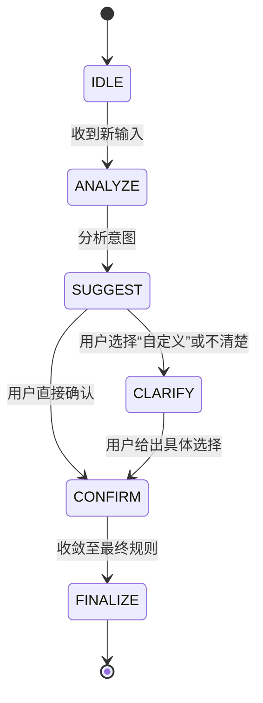

# 执行摘要  
当前的 AI 话题助手实现的是一个基于规则和状态机的五层流水线架构，实质上只做简单的关键词提取，并无真正的深度语义推理和多轮交互，前端功能也较单薄。要真正打造像美团“小美”或 Notion 3.0 那样智能的助理，需要补充诸如知识库、结构化 Prompt、动态界面等多项组件，同时面对延迟、成本、数据隐私等风险。与市面主流 AI 引擎（如美团“小美”、Notion AI、ChatGPT 插件等）相比，目前的方案缺少知识检索和自主规划能力，差异化价值主要在于聚焦“话题过滤”这一细分场景。建议尽快补充核心组件、设计多轮对话流程与前端可视化界面，并制定严谨的测试方案和路线图，保障系统可靠、高效。综合评估本项目为中高风险/价值方向，应以 MVP 验证为主线，分阶段迭代实现。

## 1. 当前架构与运行逻辑评估  
现有模块（参考内部代码文档）采用**五层流水线**，分别是：意图分类、上下文分析、状态机驱动、协议验证和内存管理层（图1所示）。从代码来看，每层职责分离：意图分类层用规则匹配生成 IntentType，输出置信度；上下文层结合历史推断对话上下文；状态机层根据意图和上下文切换状态；协议层校验响应是否符合 JSON 协议；内存层记录对话。当前看起来是**规则驱动**的处理流程，没有真正调用大模型（LLM）进行推理，输出也常以关键词列表结束。  

从知识助手的通用架构看，典型系统包括知识库、LLM 网关、聊天界面和监控模块；本项目目前只实现了最基础的规则解析，缺少**主动推荐和多轮交互**。按照 Notion 团队的说法，传统的“提示词+模型”方式在复杂场景下存在瓶颈，无法满足决策和多步推理的需求。目前系统仅在收到一句话后即输出关键词，流程极为单向，无法主动生成选项或确认用户意图。**假设与未指定项：**当前文档中未说明模型部署方式（API 调用还是本地模型）、并发量、用户身份管理、前端 UI 框架选择等；也未提到如何更新知识库、如何融入语义理解（如实体识别、同义扩展）等。这些都是需要补充的关键信息。  

## 2. 必要组件清单  
一个成熟的 AI 话题过滤助手至少需要以下组件：  

- **后端 LLM 引擎**：负责语义理解、意图识别和推理，可选如 GPT-4、GPT-OSS-120B、Qwen-3/Claude 等；最好支持结构化输出（JSON）。  
- **Prompt 与策略层**：封装对 LLM 的调用，包括系统提示词（system prompt）、上下文管理（对话历史、多轮提示）和输出解析规则。   
- **主题知识库**：涵盖各类话题实体及其**分类、别名、关联词**和内容维度（如产品、视频、社区等）。知识库可采用图数据库或文档+向量检索方式，便于按类别扩展和检索。根据 CrateDB 的架构建议，“Context Data”模块需要处理和存储业务知识。  
- **前端状态机与组件**：负责可视化交互，包括状态机逻辑（指导多轮对话流程）、展示推荐卡片、复选芯片（chips）等控件、问题确认界面、预览面板等。UI 框架可选 React/Vue，需与后端协议匹配。前端按照“Input Handler → Output Handler”模式设计，需兼顾安全与友好。  
- **存储与会话管理**：用于持久化用户对话历史、已屏蔽的主题列表、短期/长期记忆缓存、知识库等。可使用本地存储或服务器数据库，并记录日志和用户偏好设置。  
- **监控与日志**：跟踪接口调用、LLM 耗时和成本、用户点击选择等指标，以支持性能调优和异常检测。监控系统包括使用情况监测、成本分析和数据分析。  
- **权限与合规模块**：包括API 权限管理（如使用第三方模型需管理密钥访问）、用户隐私保护策略、内容审查规则等。集成如 OWASP GenAI 建议的安全检查和法律合规模块（避免用未授权开源模型造成版权/隐私问题）。  

以上组件协同工作，可参考 CrateDB 对知识助手架构的建议，把用户请求路由到 **Context Data**（知识库检索）和 **LLM 网关**，再由前端渲染反馈。  

## 3. 风险与瓶颈  
- **模型相关**：LLM 本身存在误解人意、生成不稳定内容的风险（如错误信息或歧视性语言）。尤其在缺乏明确规则引导时，模型易产生“幻觉”，给出不相关或过度泛化的答案。研究表明，结构化输出可以显著降低此类幻觉；若按当前简单 Prompt 模式，误检率可能很高。  
- **Prompt 稳定性**：提示词的微小修改可能导致输出差异，对规则严格依赖的场景尤其敏感。需要设计鲁棒的 Prompt 架构（如模板 + 例示），并进行充分测试以防回答漂移。  
- **知识库维护**：主题过滤依赖于持续更新的知识库，包括话题别名、新兴热词和关联主题。维护成本高：需要人工或自动化工具定期添加新实体、更新分类、清洗过时数据。缺乏动态更新机制时，系统难以跟上快速变化的网络热点。  
- **延迟与成本**：若采用大型模型（如120B）并在前端（如浏览器插件）实时调用，响应延迟可能显著，用户体验差。此外，此类模型的API调用成本极高，尤其在并发量大时更是瓶颈。需要考虑流式输出和请求限频。  
- **误伤与召回**：过滤系统必须平衡漏过（未屏蔽应屏蔽内容）和误杀（错误屏蔽无害内容）的率。模型识别不准和规则歧义会带来用户不满。相比直接关键词匹配，智能推荐可能降低漏检率，但也可能产生意外排除。评估指标需包括精确率、召回率。  
- **隐私与合规**：如果会记录用户偏好或将输入发送至云端，会涉及用户隐私保护和数据安全问题。另外，若使用开源模型，应注意开源许可和数据跨境等法律合规风险。需确保用户数据加密传输、遵守《个人信息保护法》等法规。  

## 4. 与市面主流引擎对比  

| 引擎           | 交互流程                             | 结构化输出 | 知识库依赖                            | 可扩展性                           | 前端渲染分工                           | 成本估算                           | 差异化机会                               |
| -------------- | ------------------------------------ | ---------- | ------------------------------------- | ---------------------------------- | -------------------------------------- | ------------------------------------ | ---------------------------------------- |
| **美团“小美”**   | 以自然语言对话为入口，通过内部接口调用实现订单、推荐、导航等服务 | 相对有限，主要是指令化结果（如完成订单） | 强依赖美团生态数据（餐厅、商户、地理信息等） | 基于美团业务场景构建，专注吃住行，难以跨领域推广 | 独立App界面，全新UI设计，不依赖聊天框 | 非常高（大型自研模型 + 高并发调用）      | 服务本地生活场景的特色能力（如一键下单）     |
| **Notion AI 3.0** | 用户输入宽泛指令（如总结、规划），系统跨模块自动制定计划并执行 | 通过操作数据库、文档等给出结构化结果     | 依赖用户工作区数据、公开文档与集成应用            | 设计用于企业级工作流，支持多种任务和工具集成    | 嵌入Notion应用页面，由后端智能体驱动流程 | 高（需付费订阅 + 强大的云端推理）       | 高度工程化的办公流程自动化，与内容管理深度集成 |
| **ChatGPT 插件** | Chat 界面互动，加上自定义插件（如网页检索、API接口等）扩展功能 | 可通过插件调用输出特定结构（如 JSON 调用） | 无固有知识库，依赖外部插件和上下文对话内容         | 插件生态丰富，可接入任意开发者提供的服务        | 基于聊天窗口的Web前端，主要是文本对话，不侧重可视化 | 中等到高（根据使用频率计费 + 插件调用费用） | 任意领域通用性强，可开发者自定义插件增加功能     |

从上表看，主流智能助手强调的往往是**功能自动化和开放性**：如美团“小美”专注本地生活，一句话实现下单；Notion AI 强调多步推理和工作流驾驶；而 ChatGPT 插件平台则重视让模型通过插件访问新信息和工具。与它们相比，我们的项目目标是**话题过滤**这一相对垂直的场景。差异化机会在于深度挖掘知识库（如上下位关系、同义词拓展）并提供可视化的过滤策略，而非简单聊天式返回。需求与用户体验上有明显不同：用户不需输入完整问题，而是通过选择卡片和勾选来配置过滤规则，这点与上述应用的交互流程迥异。

## 5. 完成度评分与优先级路线图  
**功能完成度评分（0–100）**：综合当前架构和市场需求，初步评估本项目现阶段完成度约为 **30/100**。理由在于基础规则引擎已搭建，但缺少关键部分（UI界面、知识库、多轮交互）。  

**优先级与里程碑**：建议采用“发现-验证-迭代”路线图。  
- **MVP功能列表（第1阶段，4–6 周）**：实现简单的前端页面和多选过滤卡片；完善 Prompt 输出 JSON 结构；集成一个小型知识库示例（如游戏、影视主题）。进行一次完整的用户输入→AI建议→用户确认→生成规则的多轮流程验证。  
- **第2阶段（2–3 个月）**：优化用户体验和界面，包括实时预览规则效果、关键词编辑功能；扩充知识库（更多主题与同义词）；加强后端状态管理，加入用户会话和偏好记录；进行压力测试（并发用户、延迟评估）。  
- **第3阶段（半年以上）**：根据用户反馈引入更多智能策略，如主动推荐热门话题、策略引擎多模型接入（可考虑微调或混合检索增强生成）；强化安全与合规（如敏感词过滤）；打磨商业化功能（如多语言支持、企业版管理后台等）。  

**资源估算**：按常见互联网团队标准，单功能粗略估算如下——前端开发2人月、后端（包含Prompt/LLM集成）2人月、知识库搭建1人月、测试与迭代优化1人月。服务器和 API 成本视使用模型而定，每月可从几千到几万元不等。总成本估计从 **低几十万（简化版小团队）** 到 **几百万（产品化规模，含AI服务费用）** 不等。  

## 6. 验证计划与测试用例  
- **多轮对话模拟**：设计用户意图预测准确度和流程连贯性测试，例如使用常见表达生成模拟对话脚本，确保系统能正确从“分析”过渡到“建议”、再到“确认”等状态。  
- **JSON Schema 一致性测试**：为模型输出定义严格的 JSON Schema，自动验证其结构和数据类型。每次迭代都运行 Schema 校验脚本，确保生产环境不出现非预期字段或格式错误。  
- **误判率/召回率评估**：标注一批真实或合成的用户输入及其应屏蔽范围，对比系统输出（关键词列表）与标准答案，计算“正确屏蔽项的召回率”和“误屏比率”。针对不同阈值策略做 A/B 测试。  
- **用户体验量化指标**：通过可用性测试评估界面的易用性（如完成过滤设置所需点击次数、时间）、以及用户对建议的接受度。可以收集用户反馈（是否感觉系统“懂意图”）、以及任务完成率。引入类似 SUS（System Usability Scale）问卷或 NPS 指标评估整体满意度。  

## 7. 推荐的 Prompt/Schema/状态机草案  
**（1）System Prompt 骨架示例：**  
```
你是一个“话题过滤”智能助手，其任务是将用户的自然语言需求转成结构化的过滤规则和建议。请遵守：
- **不直接回答问题**，而是分析用户意图，主动提出可选的过滤范围和关联话题。
- 输出**严格的JSON**，包含字段：stage、intent、topic、recommendations、questions、keyword_groups、ui_actions、next_step等。
- 在信息不完整时，提出 1~3 个澄清问题（questions）。
- 在信息完整时，提供可点击的建议项（recommendations）并等待用户选择。
- 推荐项应包含简短理由（reason），帮助用户理解其含义。
- 输出格式示例：
```
（提示词中最后一句让模型输出JSON结构示例）  

**（2）示例交互 JSON 输出：**  
```json
{
  "stage": "suggest",
  "intent": {
    "type": "block_topic",
    "summary": "用户希望减少与王者荣耀相关内容",
    "confidence": 0.96
  },
  "topic": {
    "name": "王者荣耀",
    "category": "游戏",
    "aliases": ["王者", "Honor of Kings"],
    "related": ["和平精英", "英雄联盟"]
  },
  "recommendations": [
    {"id": "scope_game", "label": "游戏本体", "type": "scope", "reason": "直接相关", "selected": false},
    {"id": "scope_video", "label": "视频内容", "type": "scope", "reason": "常见关联内容", "selected": false},
    {"id": "scope_stream", "label": "直播", "type": "scope", "reason": "高频关联内容", "selected": false},
    {"id": "scope_guide", "label": "攻略/教学", "type": "scope", "reason": "常见内容形态", "selected": false}
  ],
  "questions": [
    {
      "id": "q1",
      "text": "你想屏蔽到什么程度？",
      "options": [
        {"id": "all", "label": "全部相关内容"},
        {"id": "core", "label": "只屏蔽游戏本体"},
        {"id": "custom", "label": "自定义选择"}
      ],
      "required": true
    }
  ],
  "keyword_groups": [],
  "ui_actions": [
    {"type": "render_cards", "payload": {}},
    {"type": "wait_user_choice", "payload": {}}
  ],
  "warnings": [],
  "next_step": "ask_user"
}
```  

**（3）前端状态机流程图（Mermaid）：**  


**（4）示例前端组件映射表：**  
| JSON 字段          | 前端组件           | 说明                     |
|------------------|------------------|-------------------------|
| `intent.summary` | 标题/说明文案       | 简要告诉用户系统理解了什么    |
| `recommendations`| 可点击的 Chip 列表  | 多个过滤范围选项，用户可勾选   |
| `questions`      | 单选/多选按钮组    | 提问式按钮，帮助澄清需求       |
| `keyword_groups` | 分组关键词列表      | 展示每类下的关键词（可编辑）   |
| `ui_actions`     | 动画/加载指示器    | 控制当前界面状态，如“分析中”  |
| `warnings`       | 弹窗/提示框        | 显示系统提示或错误警告       |
| `next_step`      | 按钮（生成/预览） | 根据下一步提示用户进行动作   |  

以上设计使模型输出的 JSON 字段能直接映射到前端元素：比如 `recommendations` 在界面上渲染为一组可选项卡片；`questions` 渲染为按钮组供用户选择。前端状态机监听用户操作后更新 `selected` 状态，再将新的上下文传回后端 LLM，完成多轮闭环。

## 8. 结论与建议  
总体来看，**模型本身（如 openai/gpt-oss-120B）能力足够**支持话题过滤这样的语义任务，瓶颈主要在**架构设计和交互体验**。参考 Notion 3.0 的经验，仅凭更换大模型无法根本提升智能感，而需要重构系统架构。建议优先投入前端和流程设计：构建图形化的交互界面、多轮决策流程和结构化数据输出，使用户体验到“助手像在一起设计过滤规则”而非机械列词。与此同时，应建立轻量知识库，利用结构化输出规范（如 JSON schema）和多轮校验机制来保证稳定性和安全性。  

如果短期内资源有限，可先实现一个精简版 MVP（如只实现一级分类过滤、有限主题集、简化交互），验证用户需求和流程可行性；中期加强模型反馈环（如主动推荐关联话题、引入用户反馈循环优化），以差异化的用户价值为导向；长期考虑集成更多数据源和深度学习策略（如个性化记忆、离线微调等）。总之，本项目具有一定市场价值（尤其在内容过滤、未成年人保护等领域），但需谨慎评估技术与法规风险。在当前智能助手大潮中，做好细分场景的方案创新和产品体验，才是取得竞争优势的关键。  

**参考资料：** 本报告参考了公开技术文档和产业报告，如 Microsoft Azure AI 结构化输出指南、知乎关于模型结构化输出的分析、CrateDB 知识助手架构方案、OpenAI 关于 Notion 的案例、美团“小美”产品报道等。